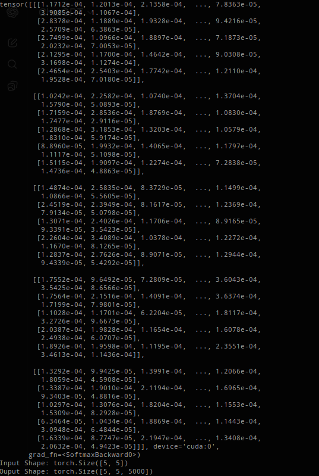

# 🧠 Transformer from Scratch — Reimplementation of “Attention Is All You Need”

## 🚀 Overview
This project is a complete, from-scratch implementation of the **Transformer architecture**, originally introduced in the 2017 paper *["Attention Is All You Need"](https://arxiv.org/abs/1706.03762)*.  
The goal was to deeply understand how attention mechanisms, positional encoding, and sequence-to-sequence learning works.

---

## 🧩 Key Features
- **Implemented Multi-Head Self-Attention** from first principles  
- **Positional Encoding** (sinusoidal) for sequence order awareness  
- **Encoder–Decoder Architecture** following the original paper design  
- **Layer Normalization, Residual Connections, and Masking**  
- **Custom Training Loop** for sequence-to-sequence tasks  

---

## 🧬 Architecture Summary
The Transformer consists of:
1. **Encoder Stack**
   - Multi-Head Self-Attention
   - Feed Forward Network
   - Add & Norm Layers  
2. **Decoder Stack**
   - Masked Multi-Head Self-Attention
   - Encoder–Decoder Attention
   - Feed Forward + Add & Norm  
3. **Output Projection**
   - Linear layer projecting to vocabulary logits  
   - Softmax activation for probabilities

---

## Transformer Architecture forward pass output

  

